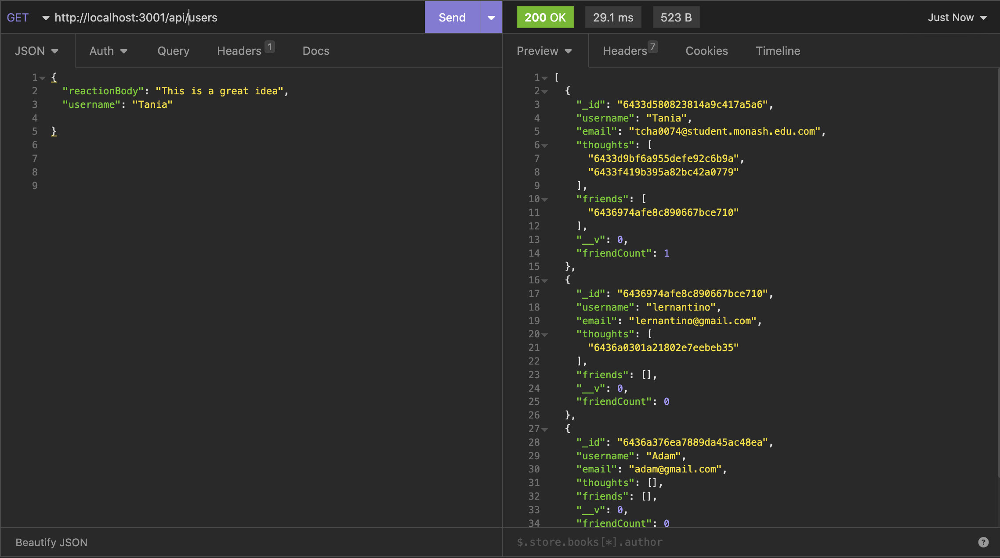
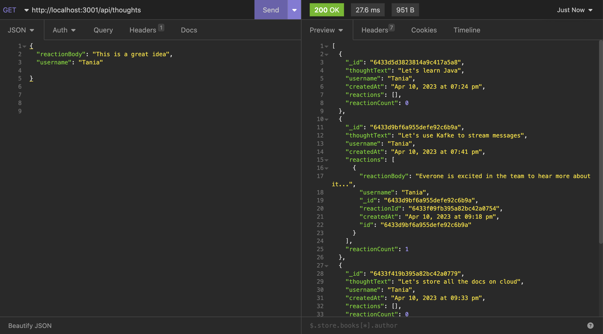
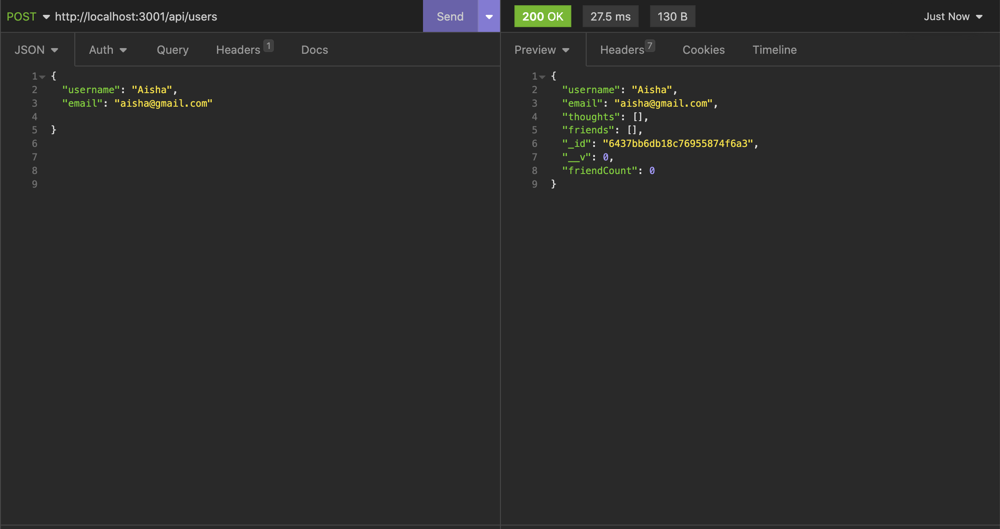
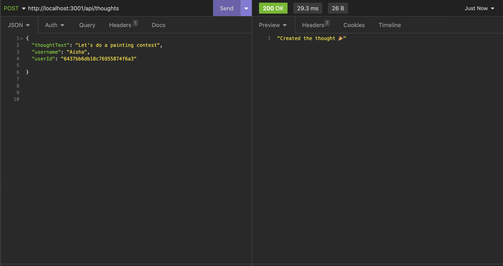
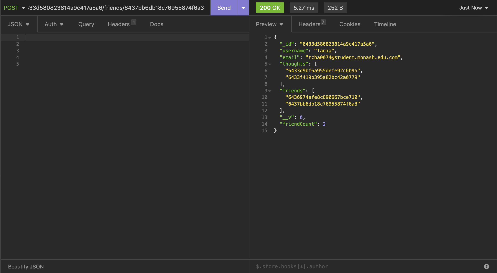
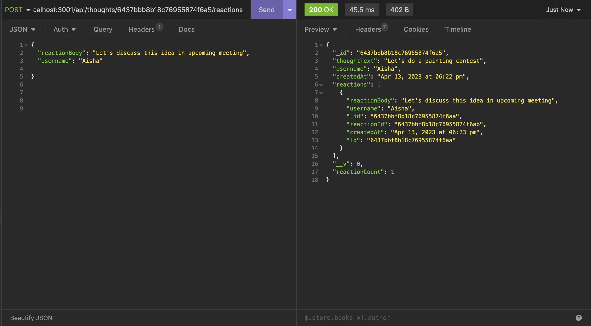

# social-network-api

# Description

This is an API for a social network web application where users can share their thoughts, react to friends' thoughts, and create a friend list. It uses Express.js for routing, a MongoDB database, the Mongoose ODM, and native JavaScript Date object to format timestamps. The seed data is created using Insomnia.

# Installation

Clone the social-media-api repository to your local machine. Start mongodb and run the npm start command. Open insomnia and test the routes for users and thoughts

# Screenshot 

# User Story

As a hiker, I want to be able to see the weather forecasts for a location so that I can pick the right day for hiking and prepare the things I need for the hike according to the weather conditions. I also want to be able to look up facts to keep me entertained while walking.

# Acceptance Criteria

GIVEN a hiker wants to go for a hike.
WHEN the hiker opens the application on the application.
THEN the hiker is able to input a specific location to search for areas to hike.

WHEN the hiker submits the location request.
THEN The application displays a list of walking locations in the area with information such as name, address, and image.

WHEN the hiker submits the location request.
THEN the a forecast is displayed of the overall conditions, including temperature and day and night outlook.

WHEN the hiker views the weather section.
THEN they see a 5 day forecast to plan their walk in advance.

WHEN the hiker views the page.
THEN there is an option to generate some fast facts to discuss with their companions.

WHEN the hiker clicks wants to revisit their search history.
THEN all the previous searches are stored for them and displayed.

# Screenshot 
The following screenshot demonstrates the application functionality:

# Link to deployed application

Link to Walk-through video: https://drive.google.com/file/d/1UsrTcet69M6ysXiunBOTQuvrCSN9FdL7/view
